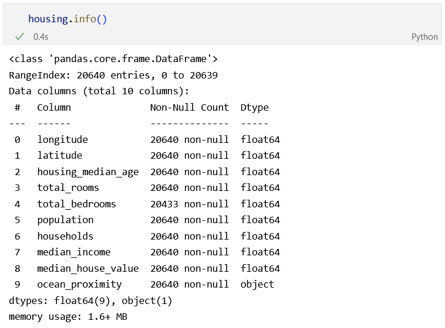
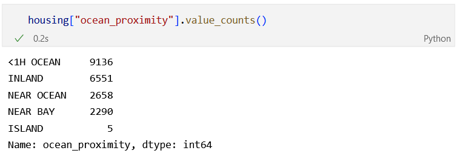
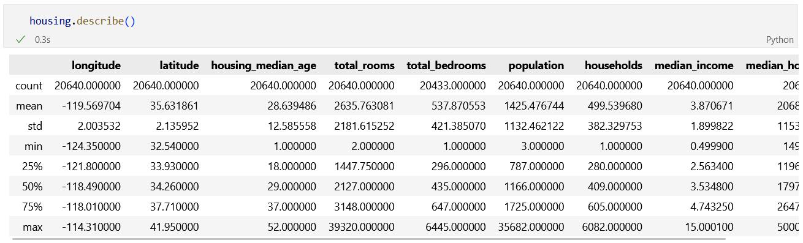
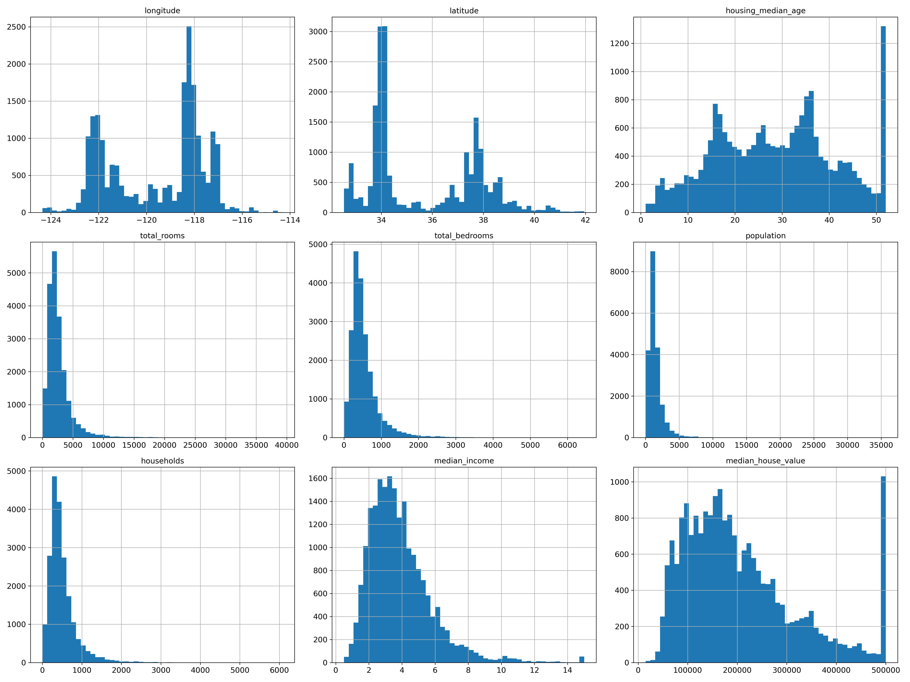
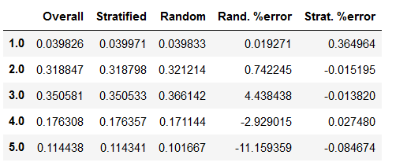
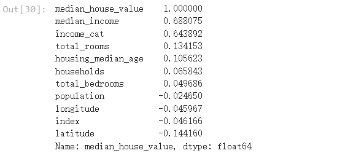
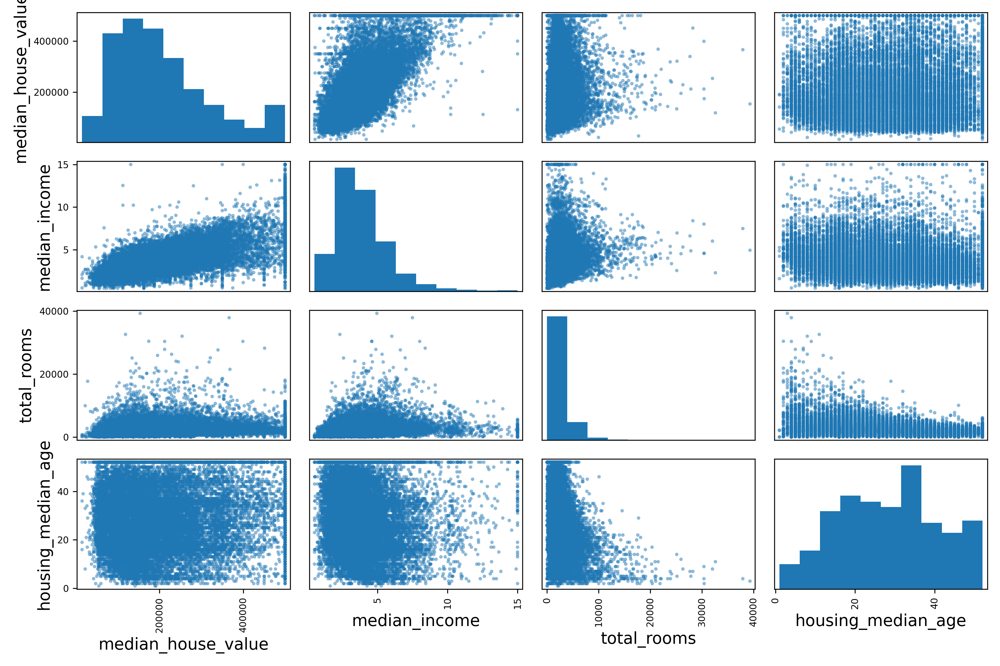
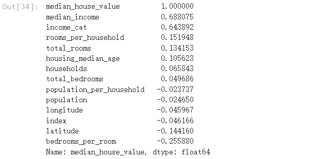

<center><font size=5>2022秋季学期人工智能课程</font></center>

<center><font size=5>第一次作业</font></center>

<center><font size=5>软件学院 林耕宇 SA22225093</font></center>


1、问题设定。通过沟通确定了业务目标，明确了要解决的问题属于回归问题，并选择了相应的性能衡量指标。本章中，所使用的性能衡量指标是什么？

在本章中所使用的性能衡量指标是均方根误差（RMSE），均方根误差测量的是系统预测误差的标准差。
$$
RMSE(X,h)=\sqrt{\frac{1}{m}\sum_{i=1}^m(h(x^{(i)})-y^{(i)})^2}
$$
2、获取数据。假定数据集已下载到本地:

（1）如何加载数据集？请写出相应的代码。

数据集以csv文件保存在本地，加载方式如下：

```python
def load_housing_data(housing_path=HOUSING_PATH):  

  csv_path = os.path.join(housing_path, "housing.csv")

  return pd.read_csv(csv_path)

housing = load_housing_data()
```

（2）数据集的总行数是？每个属性的类型是？哪个属性存在缺失值？

``housing.shape``查看housing的尺寸为(20640, 10)，可知总行数为20640

通过``housing.info()``查看属性的类型和缺失值情况，如下所示：



可以看到，出了"ocean_proximity"属性的类型为object之外，其余属性均为float64，所有属性都没有缺失。

（3）数据集中的ocean_proximity属性为非数值属性，其取值情况有哪几种？

通过``housing["ocean_proximity"].value_counts()``查看取值情况：



（4）如何查看数据集中所有数值型属性的平均值，最大值和最小值。

通过``housing.describe()``查看所有数值型属性的平均值，最大值和最小值：



（5）如何查看数据集中所有数值型属性的直方图？观察直方图，如何判断某个属性的取值被设定了上限？直方图中的“重尾”是指什么？发现重尾现象，需要进行处理吗？

调用``hist``方法画出每个属性的柱状图

```python
%matplotlib inline
import matplotlib.pyplot as plt
housing.hist(bins=50, figsize=(20,15))
save_fig("attribute_histogram_plots")
plt.show()
```



观察直方图，如果最右侧出现一个异常高的值，如median_house_value和housing_median_age，可以判断设置了上限，modian_house_value的上限为500000，housing_median_age的上限为50.

这些图中，households、population、total_bedrooms、total_rooms和median_income的直方图中出现了重尾现象，呈现出左偏分布，中位数右侧的延伸比左侧要远得多。重尾分布的通俗定义是：该分布的尾巴比任意指数分布更“重”，那么该分布就是重尾分布 。判断直方图的重尾现象可以通过观察中位数左右两侧的延伸情况来判断，如果有一侧的延伸情况要远远小于另一侧，那么可能出现重尾现象。

（6）创建测试集时，通常有哪两类抽样方式？本章中哪种抽样方式更好？为什么？

创建测试集时，通常有纯随机抽样和分层抽样两种方式。

实验分别测试了两种方式，纯随机抽样采用hash方法，分层抽样按照收入类别来进行。最后发现分层抽样得到的训练集和测试集分布更接近总体分布，因此选用分层抽样。



&nbsp;


3、研究数据。

（1）我们需要对测试集中的样本进行研究吗？为什么？

不需要也不能。测试集对我们来说应该是全新的数据，不能从测试集中学习知识。

（2）通过探寻属性之间的相关性，可以找出最重要的特征。有哪些函数可以用于探寻属性之间的相关性？ 

寻找数值类属性之间的相关性：``corr()``方法计算出每对属性间的皮尔逊相关系数，每个属性和房价中位数的相关性如下：

```python
# 计算数值属性之间的皮尔逊相关系数
corr_matrix = housing.corr()
print(corr_matrix.shape)
# 和median_house_value的相关系数
corr_matrix["median_house_value"].sort_values(ascending=False)
```



还可以使用``pandas``提供的``scatter_matrix``函数，画出每个数值属性对每个其他数值属性的相关性图

```python
# 画出每个数值属性对每个其他数值属性的图
# 从上一步选出相关性最高的四个属性

# from pandas.tools.plotting import scatter_matrix # For older versions of Pandas
from pandas.plotting import scatter_matrix

attributes = ["median_house_value", "median_income", "total_rooms",
              "housing_median_age"]
scatter_matrix(housing[attributes], figsize=(12, 8))
save_fig("scatter_matrix_plot")
```



（3）尝试增加“每个家庭的房间数量”、“每个家庭的人口数”、“卧室/房间比例”三个属性。与房价中位数相关性最高的4个属性分别是？

增加三个属性：

```python
# 增加“每个家庭的房间数量”、“每个家庭的人口数”、“卧室/房间比例”三个属性

housing["rooms_per_household"] = housing["total_rooms"]/housing["households"]
housing["bedrooms_per_room"] = housing["total_bedrooms"]/housing["total_rooms"]
housing["population_per_household"]=housing["population"]/housing["households"]
```

增加属性后，与房价中位数相关性最高的4个属性分别是：median_income、income_cat、rooms_per_household和total_rooms




4、准备数据。

（1）在此环节，需要对测试集中的数据做相关处理吗？

不需要。但是在最终测试环节需要对测试集数据做处理。

（2）你是如何处理缺失值的？

使用``sklearn``提供的``SimpleImputer``对缺失值进行填充。

```python
from sklearn.impute import SimpleImputer
imputer = SimpleImputer(strategy="median")
imputer.fit(housing_num)
x = imputer.transform(housing_num)
```

（3）为什么必须将ocean_proximity属性的文本类型转换为数值类型的？

为了方便进行处理。

（4）你是如何将ocean_proximity属性的文本类型转换为数值类型的？

使用``sklearn``提供的``OneHotEncoder``方法，将文本类型转换为独热编码。

```python
from sklearn.preprocessing import OneHotEncoder

housing_cat = housing[["ocean_proximity"]]
cat_encoder = OneHotEncoder(sparse=False)
housing_cat_1hot = cat_encoder.fit_transform(housing_cat)
```

（5）尝试增加3个新的重要特征：“每个家庭的房间数量”、“每个家庭的人口数”、“卧室/房间比例”

```python
from sklearn.base import BaseEstimator, TransformerMixin

# column index
rooms_ix, bedrooms_ix, population_ix, households_ix = 3, 4, 5, 6

class CombinedAttributesAdder(BaseEstimator, TransformerMixin):

    def __init__(self, add_bedrooms_per_room=True): # no *args or **kargs
        self.add_bedrooms_per_room = add_bedrooms_per_room

    def fit(self, X, y=None):
        return self  # 返回自身

    def transform(self, X):
        rooms_per_household = X[:, rooms_ix] / X[:, households_ix]
        population_per_household = X[:, population_ix] / X[:, households_ix]
        if self.add_bedrooms_per_room:
            bedrooms_per_room = X[:, bedrooms_ix] / X[:, rooms_ix]
            return np.c_[X, rooms_per_household, population_per_household,
                         bedrooms_per_room]
        else:
            return np.c_[X, rooms_per_household, population_per_household]

attr_adder = CombinedAttributesAdder(add_bedrooms_per_room=False)
housing_extra_attribs = attr_adder.transform(housing.values)
```

（6）你用到了特征缩放吗？你是如何实现特征缩放的？

使用了``sklearn``提供的``StandardScaler``方法，这种标准化方法对每个属性减去列均值再除以方差，对于每个属性/每列来说所有数据都聚集在0附近，标准差为1，使得数据集方差为1，均值为0

（7）尝试使用流水线，来对数据做相关处理，包括缺失值处理，文本类型转换为数值类型，特征缩放，增加新的重要属性。（这是对提交的Python代码的要求）

```python
from sklearn.pipeline import Pipeline
from sklearn.preprocessing import StandardScaler

num_pipeline = Pipeline([
        ('imputer', SimpleImputer(strategy="median")),
        ('attribs_adder', CombinedAttributesAdder()),
        ('std_scaler', StandardScaler()),
    ])


from sklearn.compose import ColumnTransformer

num_attribs = list(housing_num)
cat_attribs = ["ocean_proximity"]

full_pipeline = ColumnTransformer([
        ("num", num_pipeline, num_attribs),
        ("cat", OneHotEncoder(), cat_attribs),
    ])

num_attribs = list(housing_num)
cat_attribs = ["ocean_proximity"]

old_num_pipeline = Pipeline([
        ('selector', OldDataFrameSelector(num_attribs)),
        ('imputer', SimpleImputer(strategy="median")),
        ('attribs_adder', CombinedAttributesAdder()),
        ('std_scaler', StandardScaler()),
    ])

old_cat_pipeline = Pipeline([
        ('selector', OldDataFrameSelector(cat_attribs)),
        ('cat_encoder', OneHotEncoder(sparse=False)),
    ])

from sklearn.pipeline import FeatureUnion

old_full_pipeline = FeatureUnion(transformer_list=[
        ("num_pipeline", old_num_pipeline),
        ("cat_pipeline", old_cat_pipeline),
    ])
```


5、研究模型。

（1）训练一个SVM（使用线性核函数）。并在训练集上评估其性能。在训练集上的RMSE是？

使用``sklearn``提供的SVR模型，SVR模型是支持向量机线性回归SVR模型。

```python
from sklearn.svm import SVR
from sklearn.metrics import mean_squared_error

svm_reg = SVR(kernel="linear")
svm_reg.fit(housing_prepared, housing_labels)
housing_predictions = svm_reg.predict(housing_prepared)
svm_mse = mean_squared_error(housing_labels, housing_predictions)
svm_rmse = np.sqrt(svm_mse)
```

在训练集上的RMSE为：106873.526604078

（2）利用10折交叉验证来评估其泛化性能。在验证集上的RMSE均值是？

```python
from sklearn.model_selection import cross_val_score

scores = cross_val_score(svm_reg, housing_prepared, housing_labels,
                         scoring="neg_mean_squared_error", cv=10)
svm_rmse_scores = np.sqrt(-scores)
```

在验证集上的RMSE均值是：107892.44858711655

6、微调模型。

（1）选择最佳超参。

a)利用网格搜索，从以下超参组合中选取最佳超参。其中，网格搜索的配置为“cv=5, scoring='neg_mean_squared_error', verbose=2”。最后得到的最佳超参是？最佳超参时，验证集上的RMSE为多少？

param_grid = [

​    {'kernel': ['linear'], 'C': [10., 30., 100., 300., 1000., 3000., 10000., 30000.0]},

​    {'kernel': ['rbf'], 'C': [1.0, 3.0, 10., 30., 100., 300., 1000.0],

​     'gamma': [0.01, 0.03, 0.1, 0.3, 1.0, 3.0]},

  ]

得到的最佳超参是：{'C': 1000.0, 'kernel': 'linear'}，此时验证集上的RMSE为70279.3095392949

b)利用随机搜索，寻找超参。

随机搜索的配置如下：“param_distributions=param_distribs,                n_iter=50, cv=5, scoring='neg_mean_squared_error',                 verbose=2, random_state=42) ”，其中：param_distribs = {

​    'kernel': ['linear', 'rbf'],

​    'C': reciprocal(20, 200000),

​    'gamma': expon(scale=1.0),

}

得到的最佳超参是：{'C': 157055.10989448498, 'gamma': 0.26497040005002437, 'kernel': 'rbf'}，此时验证集上的RMSE为55218.274075780355

  （2）在测试集上评估系统。其在测试集上的RMSE是？（提示：利用流水线的transform()方法对测试集做相关处理后，再进行评估）

```python
final_model = rnd_search.best_estimator_

X_test = strat_test_set.drop("median_house_value", axis=1)
y_test = strat_test_set["median_house_value"].copy()

X_test_prepared = full_pipeline.transform(X_test)
final_predictions = final_model.predict(X_test_prepared)

final_mse = mean_squared_error(y_test, final_predictions)
final_rmse = np.sqrt(final_mse)
```

选用随机搜索得到的最佳超参，最终在测试集上的RMSE为：52844.581413450425


5、总结

注意区分什么时候应该对测试集做处理、什么时候不应该。

在最开始研究数据集性质的时候，使用总体数据集。

切分数据集开始进行数据预处理时，比如增加属性、填充空缺值、数据缩放等，不能使用测试集数据。比如不能用某属性的总体均值来填充空缺值，而要使用训练集的均值。

在最后测试阶段，要对测试集进行相同的预处理操作，同样的，不能用总体均值或者训练集均值填充空缺值，而要使用测试集自己的均值。